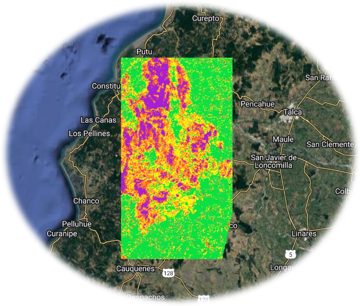

```{r setup, include=FALSE}
knitr::opts_chunk$set(echo = TRUE)
```

# ***Burn SeveridApp***

{width="367"}

*Version 1.0 (2023-02-08)*

*Author: Andrés Salazar ([ajsalazar\@uc.cl](mailto:ajsalazar@uc.cl){.email})*

\

**Web application to obtain burn severity data. These data are extracted from Landsat 8, so the images are available since 2013. The Normalized Burn Ratio (NBR) is an index designed to highlight burnt areas in large fire zones.The difference between the pre-fire and post-fire NBR obtained from the images is used to calculate the delta NBR (dNBR or ∆NBR), which then can be used to estimate the burn severity.**

**The images are obtained every 16 days, but as this app was built in GEE, it may take longer to be available. If you get an error using the app, it is likely that the images are not available for the dates you chose.**

Click <a href =  "https://andres-gee.users.earthengine.app/view/burn-severidapp" target = "_blank" rel = "noopener noreferrer"> **here** </a> to access to *Burn SeveridApp*

More info about the methodology:

<a href =  "https://un-spider.org/advisory-support/recommended-practices/recommended-practice-burn-severity/in-detail/normalized-burn-ratio" target = "_blank" rel = "noopener noreferrer"> https://un-spider.org/advisory-support/recommended-practices/recommended-practice-burn-severity/in-detail/normalized-burn-ratio </a>

\
\

<center>{width="100"}</center>
