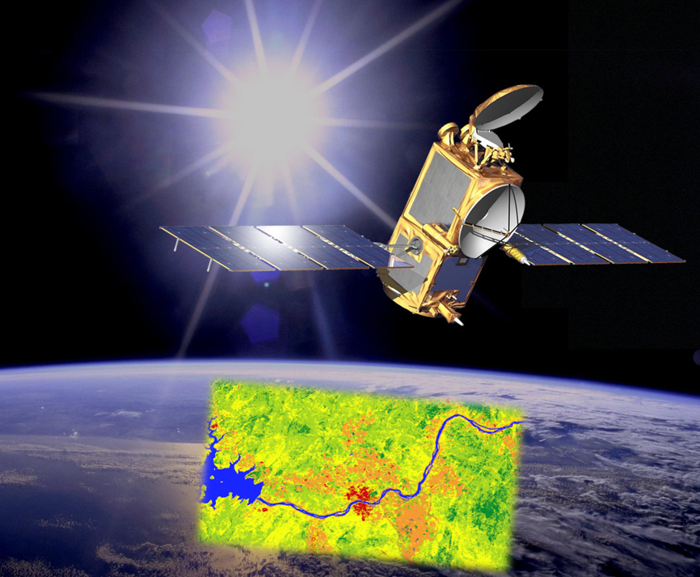
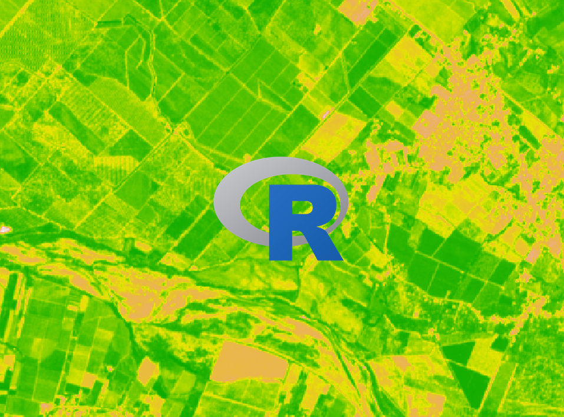
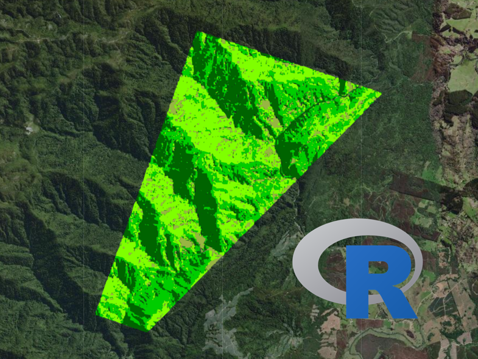
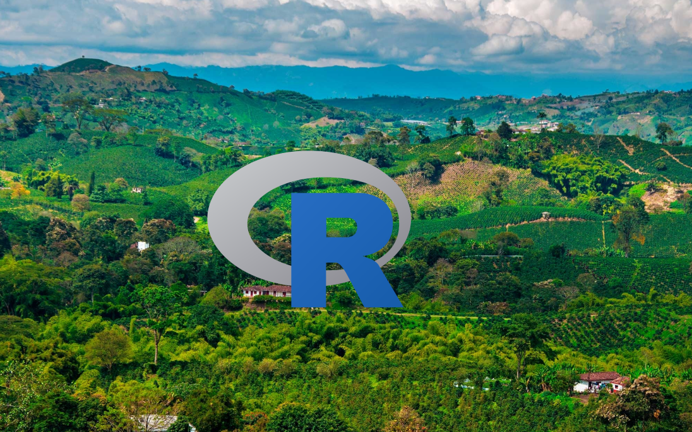

```{r setup, include=FALSE}
knitr::opts_chunk$set(echo = TRUE)
```

# **Te invito a inscribirte !!**

\

# [Google Earth Engine y Machine Learning](https://www.udemy.com/course/google-earth-engine-y-machine-learning/?referralCode=56C649FF16E5DACD42E2)

[{width="318"}](https://www.udemy.com/course/google-earth-engine-y-machine-learning/?referralCode=56C649FF16E5DACD42E2)

**Qué aprenderás:**

- **Realizar el procesamiento de grandes cantidades de datos satelitales en la nube usando el lenguaje de programación JavaScript**

- **Manejo de la plataforma Google Earth Engine para el análisis de imágenes satelitales y el calculo de índices de vegetación**

- **Realizar clasificaciones con algoritmos de Machine Learning**


\

# [Introducción a SIG y teledetección en R](https://www.udemy.com/course/introduccion-a-sig-y-teledeteccion-en-r/?referralCode=1B01AA9589CE530EC41A)

[{width="318"}](https://www.udemy.com/course/introduccion-a-sig-y-teledeteccion-en-r/?referralCode=1B01AA9589CE530EC41A)

**Qué aprenderás:**

- **Big Data Geoespacial**

- **Manejo del software de programación R**

- **Procesamiento de archivos raster y archivos vectoriales**

\

# [Mapas profesionales y mapas web con R](https://www.udemy.com/course/mapas-profesionales-e-interactivos-con-r-ggplot2-y-leaflet/?referralCode=447FB1C5FBAFFE084CEC)

[{width="321"}](https://www.udemy.com/course/mapas-profesionales-e-interactivos-con-r-ggplot2-y-leaflet/?referralCode=447FB1C5FBAFFE084CEC)

**Qué aprenderás:**

- **Manejo del software de programación R**

- **Realizar mapas profesionales para investigaciones, reportes y presentaciones con el paquete de gráficos avanzados "ggplot2"**

- **Realizar mapas web interactivos con "leaflet", para comunicar información, los cuales pueden ser publicados en páginas web para compartirlos de manera fácil y efectiva**

\

# [Introducción a ecología del paisaje en R](https://www.udemy.com/course/introduccion-a-ecologia-del-paisaje-en-r/?referralCode=2486BE25C1BB4224A397)

[{width="315"}](https://www.udemy.com/course/introduccion-a-ecologia-del-paisaje-en-r/?referralCode=2486BE25C1BB4224A397)

**Qué aprenderás:**

- **Manejo del software de programación R**

- **Big Data Geoespacial**

- **Cálculo de métricas de paisaje e índices de conectividad**