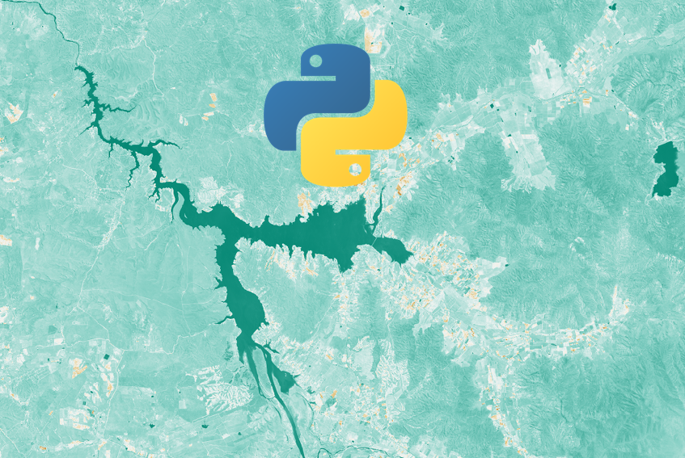
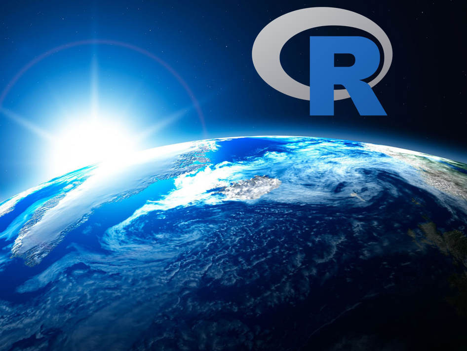
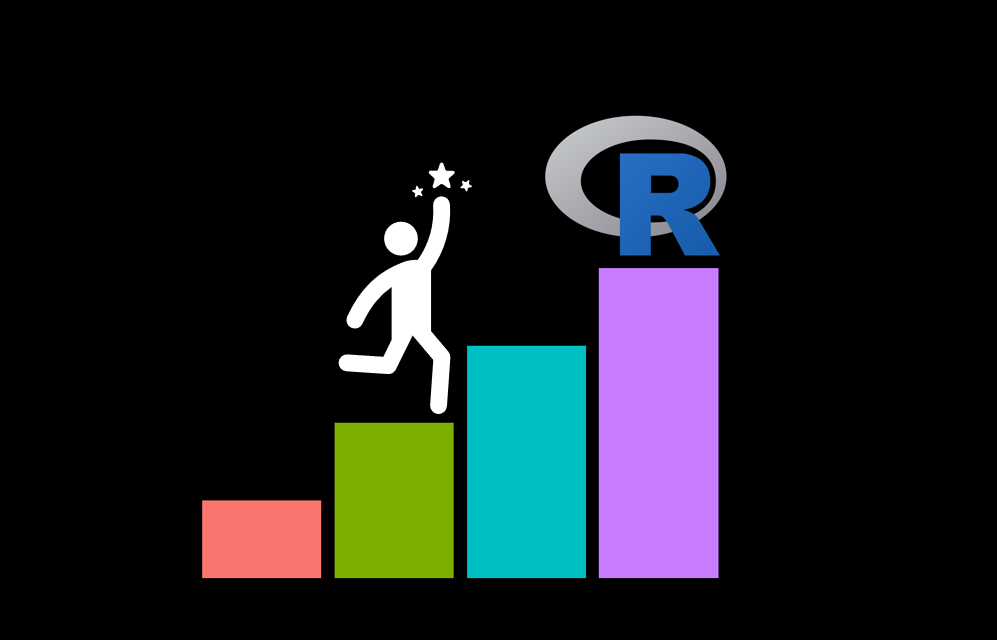
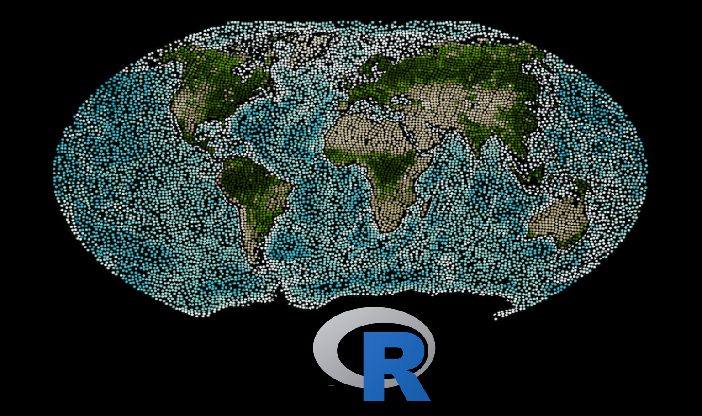

```{r setup, include=FALSE}
knitr::opts_chunk$set(echo = TRUE)

```

# **Cursos Online (Asincrónicos)**

Estos cursos se encuentran en la plataforma ***Udemy***. Son videos grabados, por lo tanto, tienen una metodología flexible que te permitirá avanzar cuando más te acomode. Los cursos contienen ejercicios para practicar lo aprendido y una vez que te inscribes, tienes acceso para siempre a ellos. El precio de estos cursos es accesible para la mayoría de los interesados. 

<a href =  "https://geostyle.github.io/ejemplos.html" target = "_blank" rel = "noopener noreferrer"> **Ejemplos de lo que aprenderás en los cursos** </a>

<a href =  "https://geostyle.github.io/opiniones.html" target = "_blank" rel = "noopener noreferrer"> **Opiniones de los cursos** </a>

<a href =  "https://geostyle.github.io/metodologia.html" target = "_blank" rel = "noopener noreferrer"> **Más detalles de la metodología de los cursos** </a>

**Para conocer más detalles sobre los contenidos y para inscribirte en los cursos, da click en su nombre**

<hr>

## <a href =  "https://www.udemy.com/course/introduccion-a-sig-y-teledeteccion-en-r/?referralCode=1B01AA9589CE530EC41A" target = "_blank" rel = "noopener noreferrer"> Introducción a SIG y Teledetección en R </a>

<a href = "https://www.udemy.com/course/introduccion-a-sig-y-teledeteccion-en-r/?referralCode=1B01AA9589CE530EC41A" target = "_blank" rel = "noopener noreferrer">  </a> 


**Qué aprenderás:**

-   **Introducción a la programación en R**

-   **Procesamiento y análisis de archivos Shapefile**

-   **Procesamiento y análisis de archivos Raster**
<hr>

## <a href =  "https://www.udemy.com/course/google-earth-engine-y-machine-learning/?referralCode=56C649FF16E5DACD42E2" target = "_blank" rel = "noopener noreferrer"> Google Earth Engine y Machine Learning </a>

<a href = "https://www.udemy.com/course/google-earth-engine-y-machine-learning/?referralCode=56C649FF16E5DACD42E2" target = "_blank" rel = "noopener noreferrer">  </a>

**Qué aprenderás:**

-   **Introducción a la programación en JavaScript**

-   **Introducción a Google Earth Engine**

-   **Análisis de imágenes satelitales y cálculo de índices de vegetación**

-   **Realizar clasificaciones supervisadas y no supervisadas con algoritmos de Machine Learning**

<hr>

## <a href =  "https://www.udemy.com/course/introduccion-a-sig-y-teledeteccion-en-python/?referralCode=FA603AF82DCB71867A29" target = "_blank" rel = "noopener noreferrer"> Introducción a SIG y Teledetección en Python </a>

<a href = "https://www.udemy.com/course/introduccion-a-sig-y-teledeteccion-en-python/?referralCode=FA603AF82DCB71867A29" target = "_blank" rel = "noopener noreferrer">  </a>

**Qué aprenderás:**

-   **Introducción a la programación en Python**

-   **Procesamiento y análisis de archivos Shapefile**

-   **Procesamiento y análisis de archivos Raster**

<hr>

## <a href =  "https://www.udemy.com/course/sig-y-teledeteccion-en-r-intermedio/?referralCode=E8B08010A13D46668014" target = "_blank" rel = "noopener noreferrer"> SIG y Teledetección en R (Intermedio) </a>

<a href = "https://www.udemy.com/course/sig-y-teledeteccion-en-r-intermedio/?referralCode=E8B08010A13D46668014" target = "_blank" rel = "noopener noreferrer">  </a>

**Qué aprenderás:**

-   **Big Data Geoespacial**

-   **Conectar Google Earth Engine con R**

-   **Procesamiento de archivos raster y archivos vectoriales**

<hr>

## <a href =  "https://www.udemy.com/course/mapas-profesionales-e-interactivos-con-r-ggplot2-y-leaflet/?referralCode=447FB1C5FBAFFE084CEC" target = "_blank" rel = "noopener noreferrer"> Mapas Web y Mapas Temáticos con R </a>

<a href = "https://www.udemy.com/course/mapas-profesionales-e-interactivos-con-r-ggplot2-y-leaflet/?referralCode=447FB1C5FBAFFE084CEC" target = "_blank" rel = "noopener noreferrer">  </a>

**Qué aprenderás:**

-   **Introducción a la programación en R**

-   **Realizar mapas para reportes con el paquete "ggplot2"**

-   **Realizar mapas web interactivos con el paquete "leaflet"**

<hr>

## <a href =  "https://www.udemy.com/course/introduccion-a-ecologia-del-paisaje-en-r/?referralCode=2486BE25C1BB4224A397" target = "_blank" rel = "noopener noreferrer"> Introducción a Ecología del Paisaje en R </a>

<a href = "https://www.udemy.com/course/introduccion-a-ecologia-del-paisaje-en-r/?referralCode=2486BE25C1BB4224A397" target = "_blank" rel = "noopener noreferrer">  </a>

**Qué aprenderás:**

-   **Introducción a la programación en R**

-   **Big Data Geoespacial**

-   **Cálculo de métricas de paisaje e índices de conectividad**

<hr>

## <a href =  "https://www.udemy.com/course/introduccion-a-r-gratis/?referralCode=36D0BFEDBFB3B24AB3A2" target = "_blank" rel = "noopener noreferrer"> Introducción a la Programación en R para Principiantes </a>

<a href = "https://www.udemy.com/course/introduccion-a-r-gratis/?referralCode=36D0BFEDBFB3B24AB3A2" target = "_blank" rel = "noopener noreferrer">  </a>

**Qué aprenderás:**

-   **Introducción a la programación en R**

-   **Funciones avanzadas con Tidyverse para el manejo de grandes cantidades de datos**

<hr>

# Online Courses (in english)

## <a href =  "https://www.udemy.com/course/introduction-to-gis-and-remote-sensing-with-r/?referralCode=B60C87ED87E7618E1C78" target = "_blank" rel = "noopener noreferrer"> Introduction to GIS and Remote Sensing with R </a>

<a href = "https://www.udemy.com/course/introduction-to-gis-and-remote-sensing-with-r/?referralCode=B60C87ED87E7618E1C78" target = "_blank" rel = "noopener noreferrer">  </a>

**What you will learn:**

-   **Spatial analysis**

-   **Raster processing**

-   **Vector processing**

\

<center>
{width="100"}
</center>