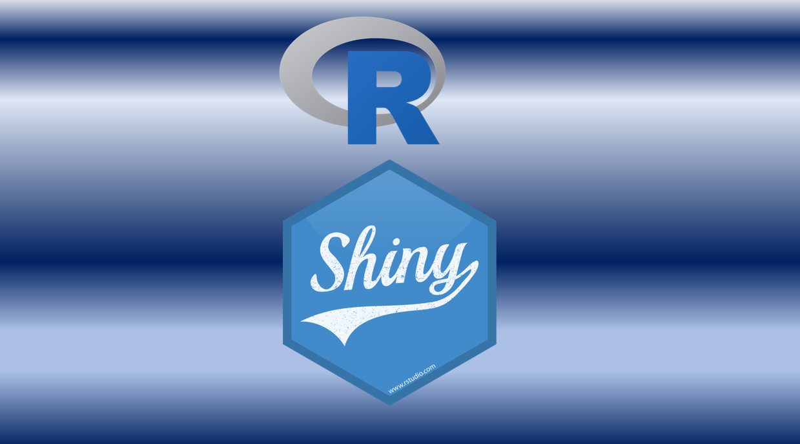

```{r setup, include=FALSE}
knitr::opts_chunk$set(echo = TRUE)

```

<br>

<h1> <strong> Cursos Online (Asincrónicos) <strong> </h1>

<br>

<p> Estos cursos se encuentran en la plataforma <em>Udemy</em>. Son videos grabados, por lo tanto, tienen una metodología flexible que te permitirá avanzar cuando más te acomode. Los cursos contienen ejercicios para practicar lo aprendido y una vez que te inscribes, tienes acceso para siempre a ellos. 

</p>


<p>
<strong>El precio de estos cursos va desde los 19.99 hasta los 29.99 USD</strong> (el precio puede ser menor, ya que a veces hay ofertas en Udemy). </p>

<p> <strong>Más de 4.000 personas ya se han inscrito a los cursos.</strong> Qué estás esperando para inscribirte! </p>

<br>

<a href =  "https://geostyle.github.io/ejemplos.html" target = "_blank" rel = "noopener noreferrer"> **Ejemplos de lo que aprenderás en los cursos** </a>

<a href =  "https://geostyle.github.io/opiniones.html" target = "_blank" rel = "noopener noreferrer"> **Opiniones de los cursos** </a>

<a href =  "https://geostyle.github.io/metodologia.html" target = "_blank" rel = "noopener noreferrer"> **Más detalles de la metodología de los cursos** </a>

<br>

**Para conocer más detalles sobre los contenidos y para inscribirte en los cursos, da click en su nombre**

<hr>

## <a href =  "https://www.udemy.com/course/introduccion-a-sig-y-teledeteccion-en-r/?referralCode=1B01AA9589CE530EC41A" target = "_blank" rel = "noopener noreferrer"> Introducción a SIG y Teledetección en R </a>

<br>

<a href = "https://www.udemy.com/course/introduccion-a-sig-y-teledeteccion-en-r/?referralCode=1B01AA9589CE530EC41A" target = "_blank" rel = "noopener noreferrer">  </a>

<h3> Qué aprenderás: </h3>

<br>

<p>

-   **Introducción a la programación en R**

-   **Procesamiento y análisis de archivos Shapefile**

-   **Procesamiento y análisis de archivos Raster**

</p>

<hr class="hr-curso">

## <a href =  "https://www.udemy.com/course/google-earth-engine-y-machine-learning/?referralCode=56C649FF16E5DACD42E2" target = "_blank" rel = "noopener noreferrer"> Google Earth Engine y Machine Learning </a>

<br>

<a href = "https://www.udemy.com/course/google-earth-engine-y-machine-learning/?referralCode=56C649FF16E5DACD42E2" target = "_blank" rel = "noopener noreferrer">  </a>

<h3> Qué aprenderás: </h3>

<br>

-   **Introducción a la programación en JavaScript**

-   **Introducción a Google Earth Engine**

-   **Análisis de imágenes satelitales y cálculo de índices de vegetación**

-   **Realizar clasificaciones supervisadas y no supervisadas con algoritmos de Machine Learning**

<br>

<hr class="hr-curso">

## <a class="titulo-curso" href =  "https://www.udemy.com/course/introduccion-a-sig-y-teledeteccion-en-python/?referralCode=FA603AF82DCB71867A29" target = "_blank" rel = "noopener noreferrer"> Introducción a SIG y Teledetección en Python </a>

<br>

<a href = "https://www.udemy.com/course/introduccion-a-sig-y-teledeteccion-en-python/?referralCode=FA603AF82DCB71867A29" target = "_blank" rel = "noopener noreferrer">  </a>


<p class="contenido-curso">

<h3> Qué aprenderás: </h3>

<br>

-   Introducción a la programación en Python

-   Procesamiento y análisis de archivos Shapefile

-   Procesamiento y análisis de archivos Raster

</p>

<hr class="hr-curso">

## <a class="titulo-curso" href =  "https://www.udemy.com/course/sig-y-teledeteccion-en-r-intermedio/?referralCode=E8B08010A13D46668014" target = "_blank" rel = "noopener noreferrer"> SIG y Teledetección en R (Intermedio) </a>

<br>

<a href = "https://www.udemy.com/course/sig-y-teledeteccion-en-r-intermedio/?referralCode=E8B08010A13D46668014" target = "_blank" rel = "noopener noreferrer">  </a>

<h3> Qué aprenderás: </h3>

<br>

-   **Big Data Geoespacial**

-   **Conectar Google Earth Engine con R**

-   **Procesamiento de archivos raster y archivos vectoriales**

<hr class="hr-curso">

## <a href =  "https://www.udemy.com/course/mapas-profesionales-e-interactivos-con-r-ggplot2-y-leaflet/?referralCode=447FB1C5FBAFFE084CEC" target = "_blank" rel = "noopener noreferrer"> Mapas Web y Mapas Temáticos con R </a>

<br>

<a href = "https://www.udemy.com/course/mapas-profesionales-e-interactivos-con-r-ggplot2-y-leaflet/?referralCode=447FB1C5FBAFFE084CEC" target = "_blank" rel = "noopener noreferrer">  </a>

<h3> Qué aprenderás: </h3>

<br>

-   **Introducción a la programación en R**

-   **Realizar mapas para reportes con el paquete "ggplot2"**

-   **Realizar mapas web interactivos con el paquete "leaflet"**

<hr class="hr-curso">

## <a href =  "https://www.udemy.com/course/introduccion-a-ecologia-del-paisaje-en-r/?referralCode=2486BE25C1BB4224A397" target = "_blank" rel = "noopener noreferrer"> Introducción a Ecología del Paisaje en R </a>

<br>

<a href = "https://www.udemy.com/course/introduccion-a-ecologia-del-paisaje-en-r/?referralCode=2486BE25C1BB4224A397" target = "_blank" rel = "noopener noreferrer">  </a>

<h3> Qué aprenderás: </h3>

<br>

-   **Introducción a la programación en R**

-   **Big Data Geoespacial**

-   **Cálculo de métricas de paisaje e índices de conectividad**

<hr class="hr-curso">

## <a href =  "https://www.udemy.com/course/introduccion-a-shinyapps-en-r-crea-aplicaciones-web/?referralCode=23156BE0D117658AD027" target = "_blank" rel = "noopener noreferrer"> Introducción a ShinyApps en R: crea aplicaciones web! </a>

<br>

<a href = "https://www.udemy.com/course/introduccion-a-shinyapps-en-r-crea-aplicaciones-web/?referralCode=23156BE0D117658AD027" target = "_blank" rel = "noopener noreferrer">  </a>

<h3> Qué aprenderás: </h3>

<br>

<ul>

<li> <strong> Introducción a la programación en R </strong> </li>

<li> <strong> Funciones avanzadas con Tidyverse para el manejo de grandes cantidades de datos </strong> </li>

<li> <strong> Crear aplicaciones web con Shiny </strong> </li>

</ul>

<hr class="hr-curso">

## <a href =  "https://www.udemy.com/course/introduccion-a-r-gratis/?referralCode=36D0BFEDBFB3B24AB3A2" target = "_blank" rel = "noopener noreferrer"> Introducción a la Programación en R para Principiantes </a>

<br>

<a href = "https://www.udemy.com/course/introduccion-a-r-gratis/?referralCode=36D0BFEDBFB3B24AB3A2" target = "_blank" rel = "noopener noreferrer">  </a>

<h3> Qué aprenderás: </h3>

<br>


<ul>

<li> <strong> Introducción a la programación en R </strong> </li>

<li> <strong> Funciones avanzadas con Tidyverse para el manejo de grandes cantidades de datos </strong> </li>

</ul>

<hr class="hr-curso">

<br>

# Online Courses (in english)

<br>

## <a href =  "https://www.udemy.com/course/introduction-to-gis-and-remote-sensing-with-r/?referralCode=B60C87ED87E7618E1C78" target = "_blank" rel = "noopener noreferrer"> Introduction to GIS and Remote Sensing with R </a>

<br>

<a href = "https://www.udemy.com/course/introduction-to-gis-and-remote-sensing-with-r/?referralCode=B60C87ED87E7618E1C78" target = "_blank" rel = "noopener noreferrer">  </a>

<h3> What you will learn: </h3>

<br>

<ul>

<li> <strong> Spatial analysis </strong> </li>

<li> <strong> Raster processing </strong> </li>

<li> <strong> Vector processing </strong> </li>

</ul>

<br>

<br>

<hr>

<br>

<center>{width="100"}</center>
