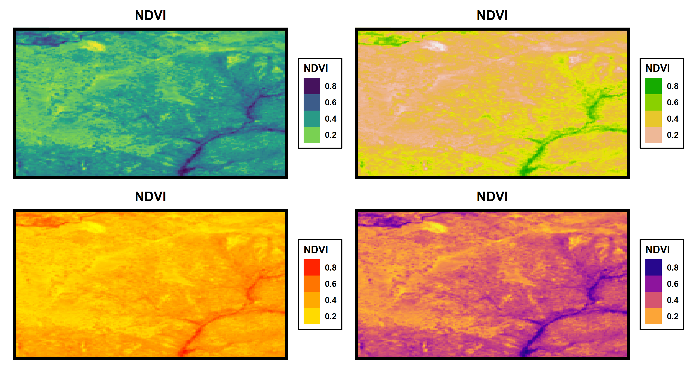
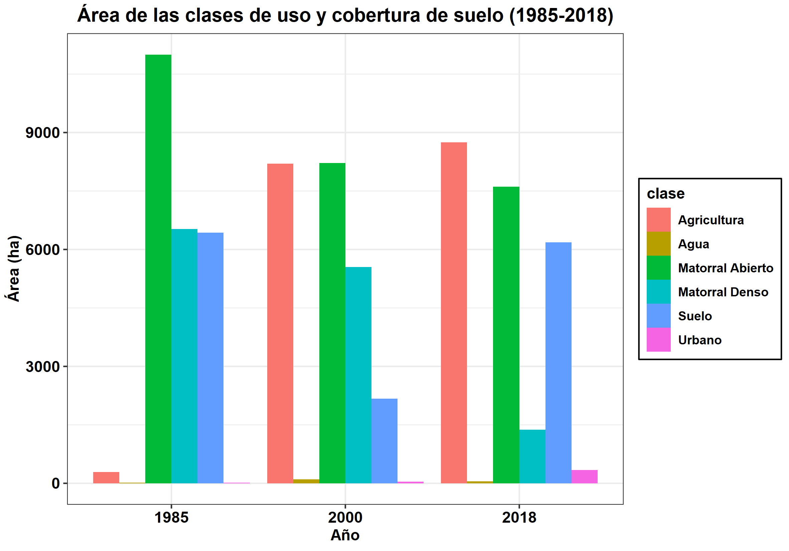

<br>

<h1> <strong> Ejemplos de lo que aprénderas en los cursos </strong> </h1>

<br>

<h3> <strong>Serie de tiempo índice NDVI</strong> </h3>

<p> <em> Curso: Mapas Web y Mapas Temáticos con R <em> </p>

<br>


<br>
<br>

<h3> <strong> Mapa web interactivo </strong> </h3>

<p> <em> Curso: Mapas Web y Mapas Temáticos con R <em> </p>

<br>

```{r, echo=FALSE, warning=F, message=F}
pacman::p_load(tidyverse,leaflet, leaflet.extras, sf, raster)

congui <- read_sf("C:/ANDRES/SIG/Capas/Vectores/Parques Nacionales/conguillio/conguillio.shp")

araucania <- read_sf("C:/ANDRES/SIG/Capas/Vectores/Parques Nacionales/araucania/araucania.shp") %>% 
  st_transform(crs = 4326)

nahuelbuta <- read_sf("C:/ANDRES/SIG/Capas/Vectores/Parques Nacionales/nahuelbuta/nahuelbuta.shp") %>% 
  st_transform(crs = 4326)

huerquehue <- read_sf("C:/ANDRES/SIG/Capas/Vectores/Parques Nacionales/huerquehue/huerquehue.shp") %>% 
  st_transform(crs = 4326)

cent_ara <- araucania[1,1] %>% st_centroid

precip <- getData(name = "worldclim", var = "prec", res = 0.5, lat = -38.64932, lon = -72.27468)

pre_jul <- precip[[7]] %>% crop(araucania) %>% mask(araucania)

paleta <- colorNumeric("viridis", domain = c(121, 511), na.color = NA, reverse = T)

leaflet() %>% 
  addProviderTiles(providers$Esri.WorldImagery) %>% 
  addPolygons(data = araucania, color = "blue", popup = "Región de la Araucanía") %>% 
  addPolygons(data = congui, color = "red", fillOpacity = 0, popup = "Parque Conguillío") %>% 
  addPolygons(data = nahuelbuta, color = "purple", fillOpacity = 0, popup = "Parque Nahuelbuta") %>% 
  addPolygons(data = huerquehue, color = "black", fillOpacity = 0, popup = "Parque Huerquehue") %>% 
  addRasterImage(pre_jul, colors = paleta) %>% 
  addLegend(pal = paleta, values = c(121, 511), title = "Precipitación (mm)", opacity = 1) %>% 
  addMeasure(primaryLengthUnit = "meters",
             secondaryLengthUnit = "kilometers",
             primaryAreaUnit = "hectares",
             secondaryAreaUnit = "sqmeters",
             activeColor = "red",
             completedColor = "red",
             position = "bottomright") %>% 
  addDrawToolbar(targetGroup = "dibujo",
                 editOptions = editToolbarOptions(selectedPathOptions = selectedPathOptions())) %>%
  addStyleEditor

```
<br>
<br>

<h3> <strong> Animación NDVI África </strong> </h3>

<p> <em> Curso: Google Earth Engine y Machine Learning <em> </p>

<br>

{width="574"}<br>
<br>
<br>

<h3> <strong> Mapa Uruguay </strong> </h3>

<p> <em> Curso: Mapas Web y Mapas Temáticos con R <em> </p>

<br>

<br>
<br>
<br>

<h3> <strong> Serie de tiempo NDVI para diferentes coberturas </strong> </h3>

<p> <em> Curso: SIG y Teledetección en R (Intermedio) <em> </p>

<br>


<br>
<br>

<h3> <strong> Índice NDVI con diferentes paletas de colores </h3> </strong>

<p> <em> Curso: Mapas Web y Mapas Temáticos con R <em> </p>

<br>

<br>
<br>
<br>

<h3> <strong> Mapa Parque Nacional Conguillío </strong> </h3>

<p> <em> Curso: Mapas Web y Mapas Temáticos con R <em> </p>

<br>


<br>
<br>

<h3> <strong> Cambio de la superficie de distintas clases de uso y cobertura de  suelo strong </strong> </h3>

<p> <em> Curso: Introducción a Ecología del Paisaje en R <em> </p>

<br>



<br>

[**Catálogo de los cursos**](https://geostyle.github.io/cursos.html)

<br>

<center>
{width="100"}
</center>