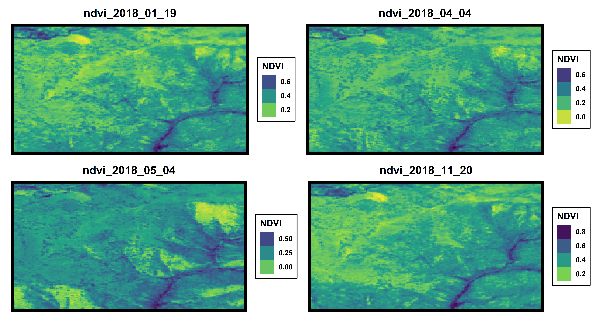

\

# **Ejemplos de lo que aprénderas en los cursos**

## **Serie de tiempo índice NDVI**

\
\
\

## **Mapa web interactivo**

```{r, echo=FALSE}
pacman::p_load(tidyverse,leaflet, leaflet.extras)

leaflet() %>% 
  addProviderTiles(providers$Esri.WorldImagery) %>% 
  addMarkers(lat = -33, lng = -71, label = "Bienvenido a GeoStyle!") %>% 
  addMeasure(primaryLengthUnit = "meters",
             secondaryLengthUnit = "kilometers",
             primaryAreaUnit = "hectares",
             secondaryAreaUnit = "sqmeters",
             activeColor = "red",
             completedColor = "red",
             position = "bottomright") %>% 
  addDrawToolbar(targetGroup = "dibujo",
                 editOptions = editToolbarOptions(selectedPathOptions = selectedPathOptions())) %>%
  addStyleEditor

```

## **Animación NDVI África**

{width="574"}\
\
\

## **Mapa Uruguay**

\
\
\

## **Serie de tiempo NDVI para diferentes coberturas** 


## **Índice NDVI con diferentes paletas de colores**

\
\
\

## **Mapa Parque Nacional Conguillío**


