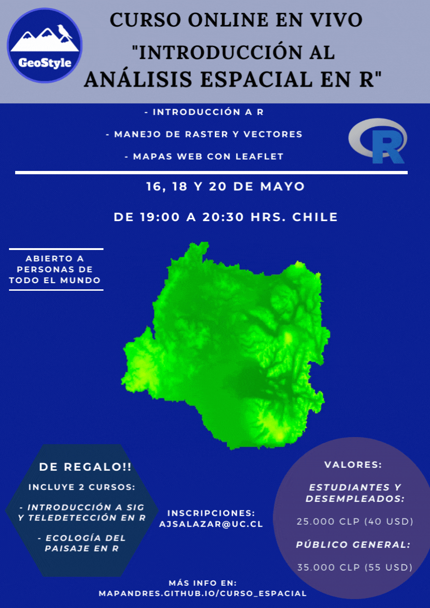

```{r setup, include=FALSE}
knitr::opts_chunk$set(echo = TRUE)
```

## **Eventos anteriores / Previous events**

\

{width="581"}

\

{width="581"}

\

{width="581"}

\

{width="581"}

\

{width="581"}

\

{width="581"}

\

{width="581"}

\

{width="586"}\
\
\

<center>

{width="100"}

</center>
