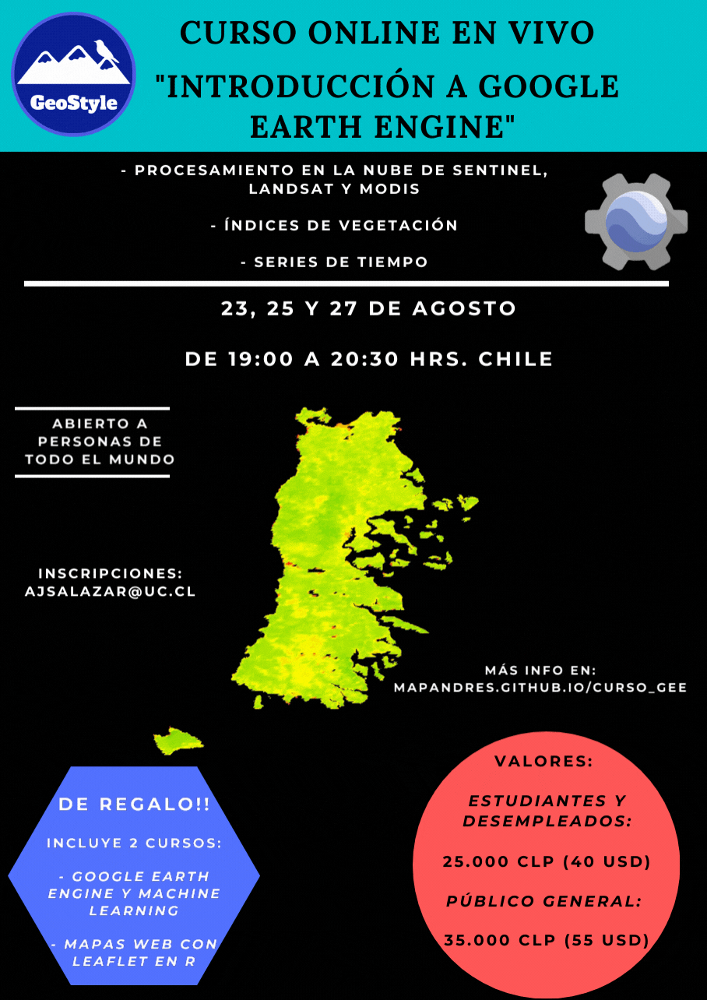

```{r setup, include=FALSE}
knitr::opts_chunk$set(echo = TRUE)
```

# **Eventos**

**Acá se publican los eventos que serán realizados (cursos en vivo, charlas, entre otros)**

\

## **Próximos**

\

**Por el momento no hay nuevos eventos programados.**

\

## **Anteriores**

\

{width="581"}

\

{width="581"}

\

{width="581"}

\

{width="581"}

\

{width="581"}

\

{width="586"}
\

<center>
{width="100"}
</center>