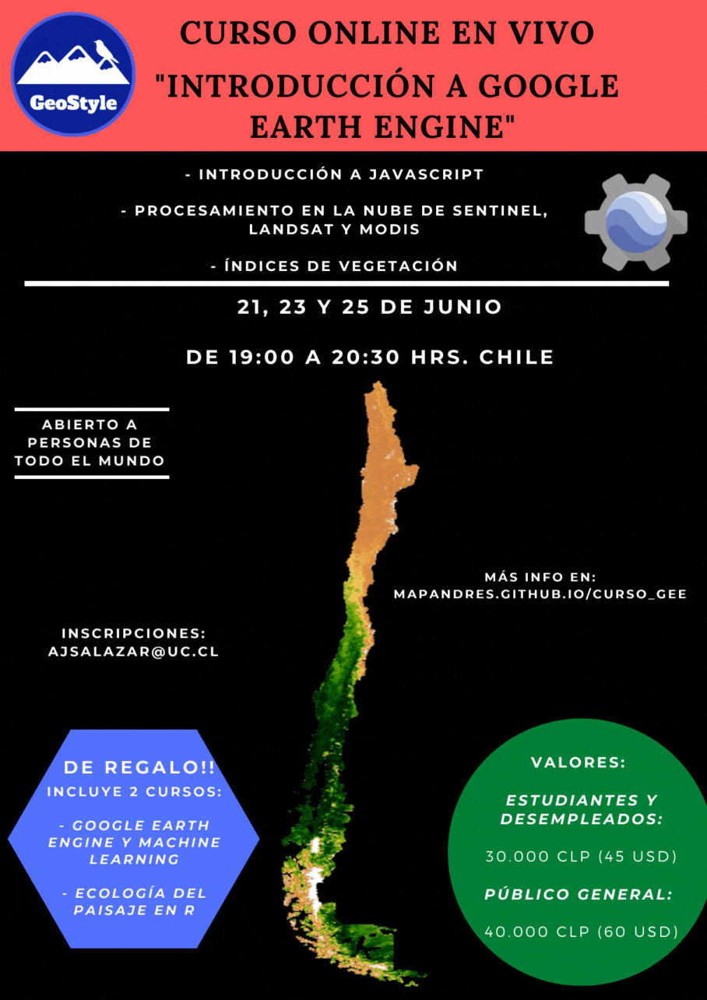
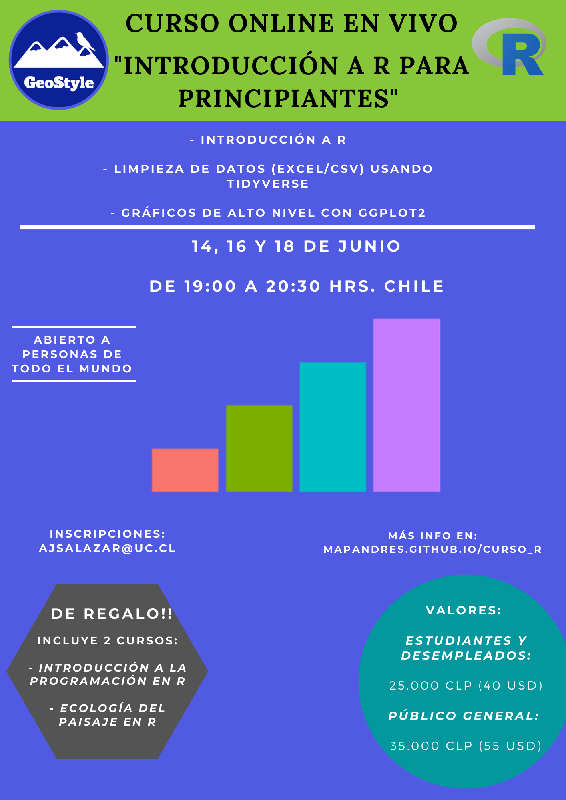
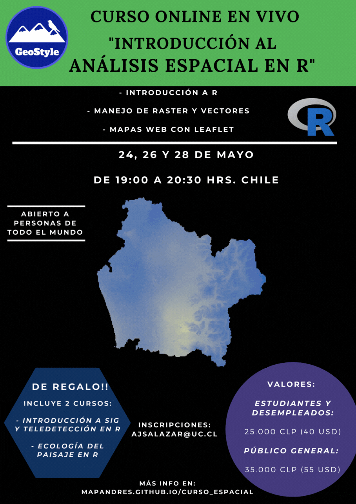
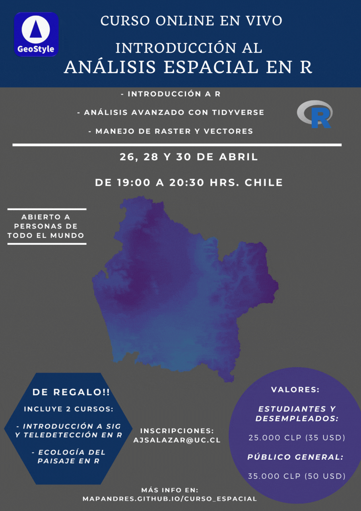

```{r setup, include=FALSE}
knitr::opts_chunk$set(echo = TRUE)
```

\

## **Próximos**

\

**Más información click [acá](https://mapandres.github.io/curso_gee/)**

{width="581"}

\

**Más información click [acá](https://mapandres.github.io/curso_r/)**

{width="581"}

## **Anteriores**

\

{width="581"}

\

{width="581"}

\

{width="586"}
