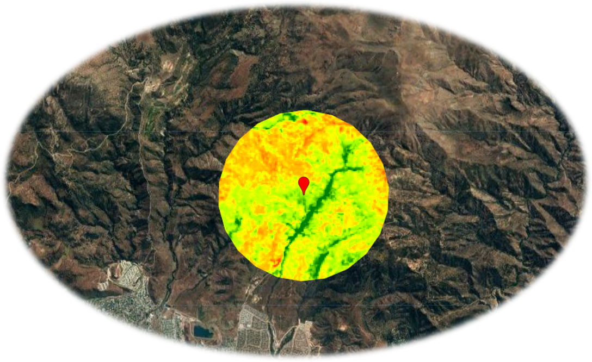

```{r setup, include=FALSE}
knitr::opts_chunk$set(echo = TRUE)
```

<br>

# ***GreenExplorer***

<br>

{width="448"}

*Version 1.0 (2023-01-29)*

*Author: Andrés Salazar ([ajsalazar\@uc.cl](mailto:ajsalazar@uc.cl){.email})*

\

**Web app to obtain NDVI, EVI and SAVI time series data. These data are extracted from Landsat 5, 7 and 8.**

**Data are available from 1984-03-16 to date. You can select the maximum cloud cover percentage by image and a value to mask the indexes values. For example, if you set the mask value as -0.1, the indexes values less than -0.1 are removed.**

Click <a href =  "https://andres-gee.users.earthengine.app/view/green-explorer" target = "_blank" rel = "noopener noreferrer"> **here** </a> to access to *GreenExplorer*

<a href =  "https://www.youtube.com/watch?v=YQA-LxP1aLE&ab_channel=GeoStyle" target = "_blank" rel = "noopener noreferrer"> **Video** </a>


<br>

<hr>

<br>

<center>{width="100"}</center>
