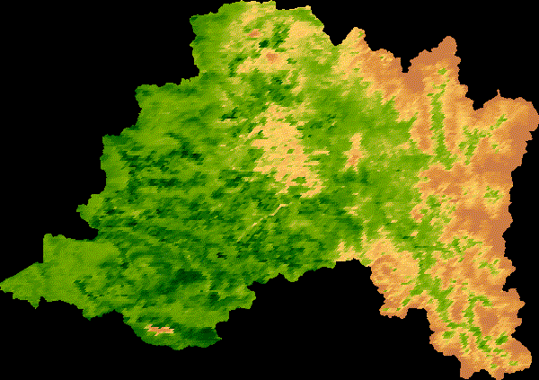

# Bienvenidos y bienvenidas!

{width="228"}

**Interactúa con el mapa !** (**Si quieres aprender a hacerlos ve a la pestaña "*Cursos*")**\

```{r, echo=FALSE}
pacman::p_load(tidyverse,leaflet, leaflet.extras)

leaflet() %>% 
  addProviderTiles(providers$Esri.WorldImagery) %>% 
  addMarkers(lat = -33, lng = -71, popup = "Estación") %>% 
  addMeasure(primaryLengthUnit = "meters",
             secondaryLengthUnit = "kilometers",
             primaryAreaUnit = "hectares",
             secondaryAreaUnit = "sqmeters",
             activeColor = "red",
             completedColor = "red",
             position = "bottomright") %>% 
  addDrawToolbar(targetGroup = "dibujo",
                 editOptions = editToolbarOptions(selectedPathOptions = selectedPathOptions())) %>%
  addLayersControl(overlayGroups = c("dibujo"),options = layersControlOptions(collapsed = FALSE)) %>%
  addStyleEditor

```


