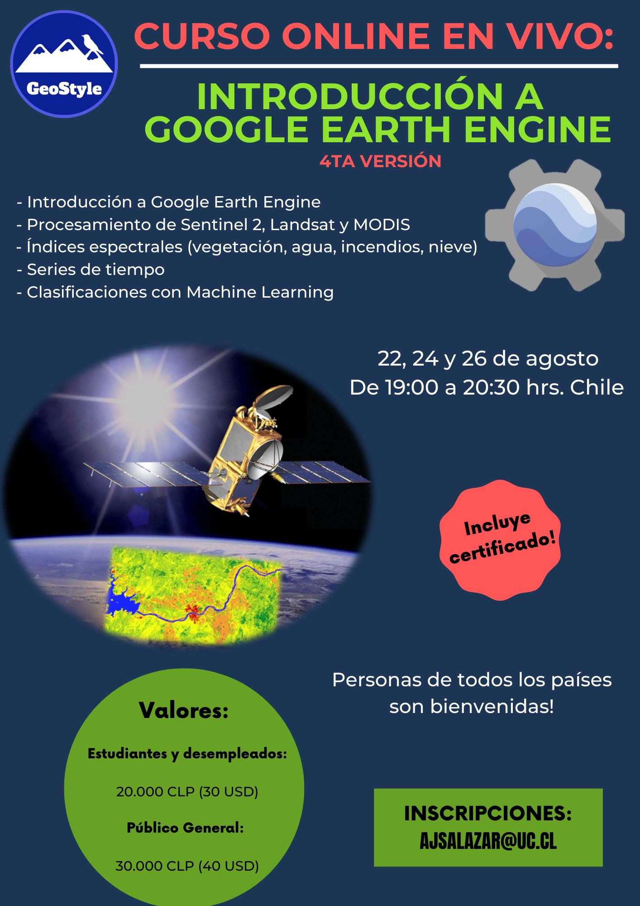

```{r setup, include=FALSE}
knitr::opts_chunk$set(echo = TRUE)
```

## **Próximo evento / Next event:**

\

{width="581"}

## ¿Qué obtengo al inscribirme?

1)  [Acceso al curso online en vivo ***"Introducción a Google Earth Engine"***]{style="color:red"}, el cual consiste en 3 sesiones de 1 hora y 30 minutos cada una. Este es un curso teórico/práctico.

\

2)  [Acceso **GRATIS** al curso ***Google Earth Engine y Machine Learning***]{style="color:red"}, el cuál es un [curso asincrónico]{style="color:red"} (son videos grabados en la plataforma ***Udemy***). En este curso vas a poder practicar lo aprendido (más información click [acá](https://www.udemy.com/course/google-earth-engine-y-machine-learning/?referralCode=56C649FF16E5DACD42E2))

\

3)  [Acceso **GRATIS** al curso ***Mapas Web y Mapas Temáticos con R: Leaflet y ggplot2***]{style="color:red"}, el cuál es un [curso asincrónico]{style="color:red"} (son videos grabados en la plataforma Udemy). En este curso vas a poder practicar lo aprendido (más información click [acá](https://www.udemy.com/course/mapas-profesionales-e-interactivos-con-r-ggplot2-y-leaflet/?referralCode=447FB1C5FBAFFE084CEC))

\

## ¿Qué aprenderé?

-   Big Data Geoespacial

-   Manejo de la plataforma Google Earth Engine

-   Manejo básico de JavaScript

-   Análisis de DEM (Digital Elevation Model)

-   Análisis de imágenes satelitales (Sentinel 2, LandSat 8, MODIS)

-   Cálculo de índices de vegetación

-   Series de tiempo

-   Clasificaciones con algoritmos de Machine Learning

\

## ¿Qué ventajas me entrega Google Earth Engine?

-   Puedes procesar imágenes satelitales en la nube, sin la necesidad de descargar archivos pesados

-   Tendrás acceso a una cantidad muy grande de datos satelitales y a una velocidad impresionante, ya que Google nos permite usar sus "súper computadores".

-   No tendrás que realizar el mismo procedimiento una y otra vez de forma lenta y agotadora.

-   A través de códigos de programación podrás replicar tareas y funciones especificas todas las veces que quieras y de una forma fácil.

\

## ¿En qué fecha es el curso en vivo?

[**22, 24 y 26 de agosto**]{style="color:red"} Desde las [**19:00 hasta las 20:30 hrs.**]{style="color:red"} de Chile

\

## ¿Los cursos entregan certificado?

[**Si, los 3 cursos entregan certificado.**]{style="color:red"} No es necesario hacer un trabajo de aprobación para recibir el certificado.

## ¿Puedes contar un poco más sobre los cursos asincrónicos de regalo?

Estos cursos tienen una metodología flexible, ya que estos son [videos grabados]{style="color:red"} que se encuentran en la plataforma ***Udemy*** y podrás avanzar cuando más te acomode. Además, en estos cursos podrás reforzar y practicar lo aprendido en el curso realizado en vivo.

Puntos importantes:

-   Una vez que te inscribes al curso, tienes [acceso de por vida al contenido]{style="color:red"}, por lo que puedes avanzar en el curso a tu propio ritmo.

-   Los cursos tienen tareas para practicar lo aprendido. Las tareas no son obligatorias, pero se recomienda que las realices, ya que para dominar lo aprendido en los cursos tienes que practicar y practicar. Recuerda que la práctica hace al maestro.

-   Una vez finalizado el curso, [recibes un certificado de aprobación del curso.]{style="color:red"}

\

## No soy de Chile, ¿puedo participar igual?

Si, este curso está abierto a personas de [todos los países del mundo.]{style="color:red"}

\

## ¿Cómo sé si el curso es bueno?

Acá puedes ver algunos comentarios de personas que han realizado los cursos

\


\

## Cuál es el valor del curso?

-   [**Estudiantes y desempleados:**]{style="color:red"} **20.000 CLP (Extranjeros: 30 USD)**

-   [**Público general:**]{style="color:red"} **30.000 CLP (Extranjeros: 40 USD)**

\

## ¿Cómo se realiza el pago?

-   [**Personas de Chile:**]{style="color:red"} a través de **transferencia bancaria**

-   [**Otros países:**]{style="color:red"} a través de **PayPal** (sistema súper seguro para transferir dinero desde el extranjero)

\*Estos datos serán entregados una vez que mandes un mail para inscribirte.

\

## Soy extranjero y nunca he usado PayPal

No te preocupes, es un sistema súper seguro. Hemos recibido transferencias de dinero de muchos países y nunca hemos tenido problemas con PayPal. Sólo necesitas una tarjeta de crédito para vincularla con tu cuenta de PayPal.

Si quieres más información de como funciona PayPal, haz click [acá](https://www.paypal.com/cl/webapps/mpp/what-is-paypal)

\

## ¿Qué conocimientos previos necesito?

-   Sólo necesitas conocimientos previos [básicos de SIG y Teledetección]{style="color:red"}

-   [**No es necesario** conocimiento previo de programación]{style="color:red"}

\

## ¿Las clases serán grabadas?

[Si, serán grabadas y compartidas a los asistentes en un carpeta de Google Drive]{style="color:red"}

\

## ¿Qué puedo hacer si quiero participar, pero tengo problemas con la fecha?

[Puedes inscribirte igual y ver los videos de las clases grabadas]{style="color:red"}, ya que los videos de estas se comparten a los inscritos en un carpeta de Google Drive

\

## ¿Cómo es el programa de los contenidos del curso?

**1) Lunes 22/8:**

-   Introducción a Google Earth Engine

-   Análisis de imágenes satelitales (1ra parte)

**2) Miércoles 24/8:**

-   Análisis de imágenes satelitales (2da parte)

-   Índices espectrales

**3) Viernes 26/8:**

-   Series de tiempo

-   Clasificaciones con Machine Learning

\

## En qué plataforma se realizará el curso

Se realizará en ***Google Meet***

\

## ¿Quién dictará el curso?

Andrés Salazar, Ingeniero Agrónomo, Magíster en Recursos Naturales. Pontificia Universidad Católica de Chile

Pefil Linkedin: <https://www.linkedin.com/in/andr%C3%A9s-salazar-6213b6163/>

Perfil ResearchGate: <https://www.researchgate.net/profile/Andres-Salazar-14>

\

## ¿Dónde me inscribo?

Escribe un mail a [ajsalazar\@uc.cl](mailto:ajsalazar@uc.cl){.email}

Indicando:

[**1)**]{style="color:red"} País de residencia

[**2)**]{style="color:red"} Categoría: estudiante/desempleado o público general

[**3)**]{style="color:red"} Nivel de conocimientos previos de SIG y Teledetección

[**4)**]{style="color:red"} Nivel de conocimientos previos en algún lenguaje de programación ([**no es necesario** tener conocimientos previos de programación]{style="color:red"})

Las preguntas de conocimientos previos son para saber [**cómo guiar las clases**]{style="color:red"} para que sea más fácil de aprender para los asistentes.

\
\

*GeoStyle, Chile. 2022*

\

<center>{width="100"}</center>
